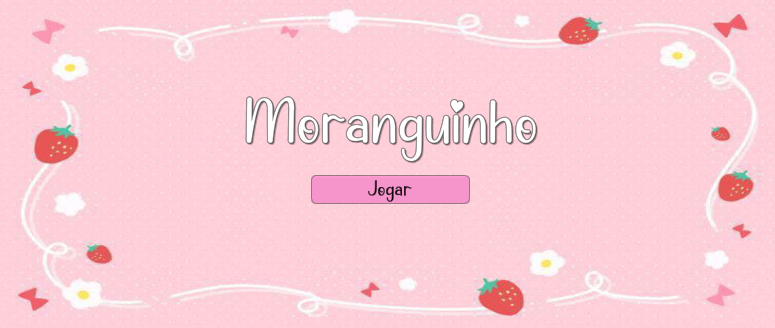
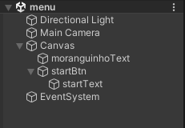
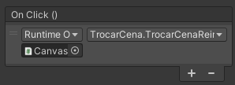
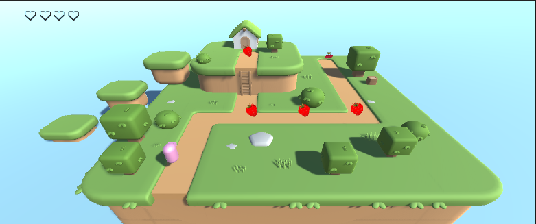
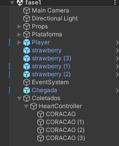
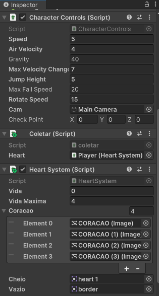
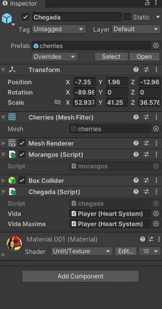
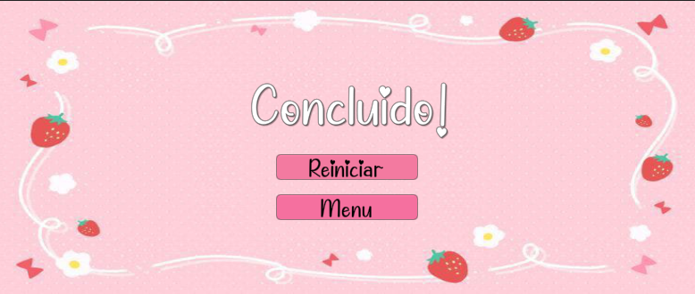
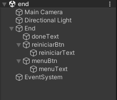

# Moranguinho
Um jogo feito no Unity, 3D e com o intuito de o jogador passar recolhendo todos os morangos do mapa. O objetivo desse jogo é utilizar as propriedades do canvas do unity.

# Fotos do Jogo
## Menu


#### Hierarquia do Menu


#### Inspetor do Menu - BOTÃO
Arrastar o canvas (que possui o código) e chamar a função TrocarCenaReiniciar() do script TrocarCena.


### Trocar de Cena (Reiniciar)
Funciona para trocar de cena para começar a jogar.
```csharp
using UnityEngine;
using UnityEngine.UIElements;
using UnityEngine.SceneManagement;

public class TrocarCena : MonoBehaviour
{
  
    public void TrocarCenaReiniciar(){
        // mudar a cena para a cena fase1
        SceneManager.LoadScene("fase1");
    }
}
```

## Jogo


#### Hierarquia do Jogo


#### Inspetor do Jogo - JOGADOR & CHEGADA(gameobject para mudar de cena)



### Sistema de Coração
Funciona para verificar se o coração deve estar vazio ou cheio.

```csharp
using UnityEngine.UI;

public class HeartSystem : MonoBehaviour
{
    public int vida;
    public int vidaMaxima;

    public Image[] coracao;
    public Sprite cheio;
    public Sprite vazio;

    void Update()
    {
        HealthLogic();
    }
    
    void HealthLogic(){
        if(vida > vidaMaxima){
                vida = vidaMaxima; }
        for (int i = 0; i < coracao.Length; i++){
            if(i < vida){
                coracao[i].sprite = cheio;
            }
            else{
                coracao[i].sprite = vazio;
            }
            if(i < vidaMaxima){
              coracao[i].enabled = true;
            }
            else{
                 coracao[i].enabled = false;
            }
        }
    } 
}
```

### Sistema de Coleta de Coração
Funciona para quando o player encostar nos corações contar como um coração colhido no HUD.
```csharp
using System.Collections;
using System.Collections.Generic;
using UnityEngine;

public class coletar : MonoBehaviour
{
     // chamando o script de sistema de coração
     public HeartSystem heart;

    // encostar em um gameobject trigger vai contar como um coração coletado no HUD
    void OnTriggerEnter (Collider other) {    
         other.gameObject.SetActive(false);
         heart.vida++;
         
    }
}
```

### Sistema de Chegada
Funciona para verificar se o Gameobject foi colisionado para mudar de cena.
```csharp
using UnityEngine.SceneManagement;

public class chegada : MonoBehaviour
{
    void OnTriggerEnter (Collider other) { 
            SceneManager.LoadScene("end");
        }
}
```

### Rotacionar os Morangos
Funciona para rotacionar os morangos quando o jogo começar.
```csharp
void Update()
    {
           transform.Rotate(0f, 0f,25f * Time.deltaTime);
    }
```


### 
## Fim 


#### Fim Hierarquia


### Trocar de cena para Menu
Funciona para trocar a cena para o menu do jogo.
```csharp
using UnityEngine.SceneManagement;

public class TrocarMenu: MonoBehaviour
{
    public void TrocarCena(){
        // Trocar a cena para o menu do jogo
        SceneManager.LoadScene("menu");
    }
}
```
# Links Importantes
### Link do Jogo 
- https://drive.google.com/file/d/1ifPRNFzv0VqznAzTfze2Wa0DKBBosrbR/view?usp=sharing
### Link do Video 
- https://youtu.be/mbY28V3xiHw
### Link dos Assets usados 
- Ambiente: https://assetstore.unity.com/packages/3d/environments/landscapes/toon-environments-world-creator-pack-lite-264325
- Morangos: https://assetstore.unity.com/packages/3d/props/food/low-poly-fruit-pickups-98135
- Personagem: https://assetstore.unity.com/packages/templates/packs/obstacle-course-pack-178169
# Autores
Yuri Telis Garcia & Mariana Santiago Matos
